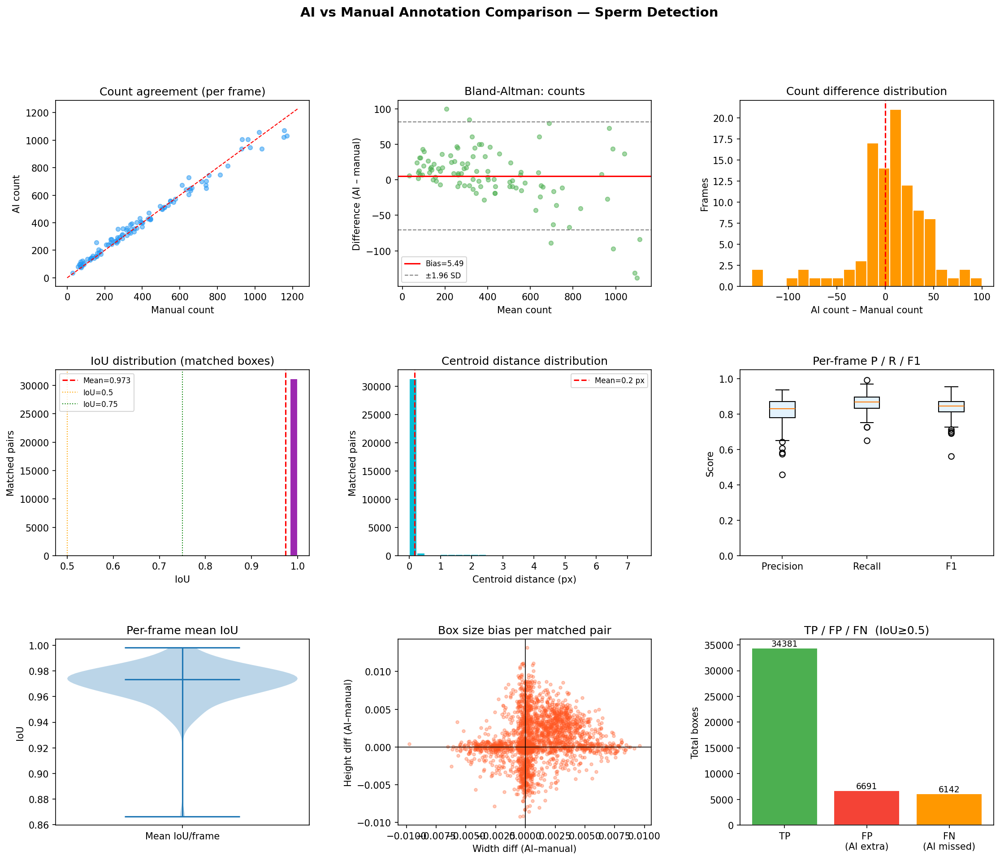

# YOLO Annotation Comparison Summary

## Overview

| Metric | Value |
|--------|-------|
| Frames analysed | 100 |
| Total matched pairs (TP) | 34381 |
| Total false positives (AI only) | 6691 |
| Total false negatives (missed) | 6142 |

## Count agreement

| Metric | Value |
|--------|-------|
| Mean AI count/frame | 410.72 ± 264.82 |
| Mean manual count/frame | 405.23 ± 283.66 |
| Mean count difference (AI - manual) | 5.49 ± 38.75 |
| ICC (count) | 1.000 |
| Wilcoxon p-value (counts) | 0.0092 |

## Detection quality (IoU ≥ 0.5)

| Metric | Value |
|--------|-------|
| Mean Precision | 0.815 ± 0.084 |
| Mean Recall | 0.862 ± 0.056 |
| Mean F1 | 0.835 ± 0.059 |

## IoU of matched pairs

| Metric | Value |
|--------|-------|
| Mean IoU | 0.973 |
| Median IoU | 1.000 |
| Std IoU | 0.094 |
| % IoU ≥ 0.75 | 94.2% |

## Centroid distance (pixels)

| Metric | Value |
|--------|-------|
| Mean | 0.17 px |
| Median | 0.00 px |

## Box size differences (AI - manual, normalised)

| Metric | Value |
|--------|-------|
| Width bias | 0.0001 (p=0.0000) |
| Height bias | 0.0001 (p=0.0000) |

## Metrics description

- **Frames analysed**: Number of image frames where AI and manual annotations were compared.
- **Matched pairs (TP)**: Number of AI–manual box pairs matched using the IoU threshold (IoU ≥ 0.5).
- **False positives (FP)**: AI detections that could not be matched to any manual annotation (extra boxes).
- **False negatives (FN)**: Manual annotations that did not have a corresponding AI detection (missed boxes).
- **Precision**: Proportion of AI detections that are correct, TP / (TP + FP).
- **Recall**: Proportion of manual annotations that are recovered by the AI, TP / (TP + FN).
- **F1 score**: Harmonic mean of precision and recall, summarising detection performance in a single number.
- **Mean IoU / IoU distribution**: Overlap between matched AI and manual boxes; higher values indicate closer spatial agreement.
- **Centroid distance (pixels)**: Euclidean distance between the centres of matched boxes, measured in image pixels.
- **Box size differences (AI - manual)**: Bias in normalised width and height; positive values mean the AI boxes tend to be larger than manual boxes.
- **ICC (count)**: Intraclass correlation coefficient for sperm counts per frame, quantifying overall count agreement between AI and manual annotations.
- **Wilcoxon p-values**: Non-parametric tests for systematic differences in counts or box sizes; small p-values indicate statistically significant bias.

## Visual summary

## Outputs

- [per_frame_stats.csv](per_frame_stats.csv)
- [comparison_plots.png](comparison_plots.png)
