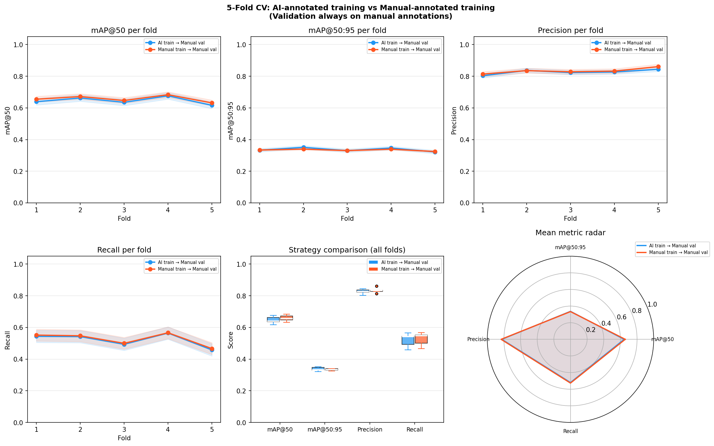

# 5-Fold Cross-Validation: Strategy A vs Strategy B

**Strategy A**: Train on AI annotations, validate on manual
**Strategy B**: Train on manual annotations, validate on manual

Both strategies share the same fold splits (paired comparison).

---

## Cross-Validation Summary

| Metric | Strategy A | Strategy B |
|--------|------------|------------|
| Precision | 0.8267 ± 0.0155 | 0.8340 ± 0.0171 |
| Recall | 0.5204 ± 0.0435 | 0.5263 ± 0.0418 |
| mAP@50 | 0.6459 ± 0.0236 | 0.6577 ± 0.0204 |
| mAP@50:95 | 0.3365 ± 0.0122 | 0.3336 ± 0.0065 |

## Comparison Plots

---

## Statistical Comparison: B vs A

| Metric | mean_A | mean_B | B-A (95% CI) | t-test p | Cohen's d | Wilcoxon p |
|--------|--------|--------|--------------|----------|-----------|-------------|
| mAP@50 | 0.6459 | 0.6577 | +0.0118 ([0.007, 0.016]) | 0.0022* | 3.1311 | 0.0625 |
| mAP@50:95 | 0.3365 | 0.3336 | -0.0029 ([-0.010, 0.005]) | 0.3468 | -0.4764 | 0.8125 |
| Precision | 0.8267 | 0.8340 | +0.0073 ([-0.001, 0.016]) | 0.0744 | 1.0729 | 0.1250 |
| Recall | 0.5204 | 0.5263 | +0.0059 ([0.003, 0.009]) | 0.0068* | 2.3023 | 0.0625 |

* p < 0.05

---

## Interpretation

- **mAP@50**: Strategy B improves over A by +0.0118 (95% CI [0.007, 0.016]) — significant (t-test p=0.0022)
- **mAP@50:95**: Strategy B decreases over A by -0.0029 (95% CI [-0.010, 0.005]) — not significant (t-test p=0.3468)
- **Precision**: Strategy B improves over A by +0.0073 (95% CI [-0.001, 0.016]) — not significant (t-test p=0.0744)
- **Recall**: Strategy B improves over A by +0.0059 (95% CI [0.003, 0.009]) — significant (t-test p=0.0068)

---

## Per-Fold Metrics

| fold | strategy | mAP50 | mAP50_95 | precision | recall | train_time_s |
|------|----------|-------|----------|-----------|--------|--------------|
| 1 | A | 0.6391 | 0.3329 | 0.8031 | 0.5438 | 263.5 |
| 1 | B | 0.6549 | 0.3340 | 0.8135 | 0.5517 | 286.4 |
| 2 | A | 0.6626 | 0.3510 | 0.8367 | 0.5421 | 318.8 |
| 2 | B | 0.6717 | 0.3399 | 0.8355 | 0.5474 | 327.1 |
| 3 | A | 0.6353 | 0.3299 | 0.8232 | 0.4936 | 284.1 |
| 3 | B | 0.6468 | 0.3305 | 0.8280 | 0.4997 | 257.5 |
| 4 | A | 0.6762 | 0.3468 | 0.8267 | 0.5646 | 260.4 |
| 4 | B | 0.6834 | 0.3394 | 0.8322 | 0.5664 | 337.2 |
| 5 | A | 0.6163 | 0.3217 | 0.8439 | 0.4580 | 272.2 |
| 5 | B | 0.6315 | 0.3243 | 0.8607 | 0.4664 | 261.3 |