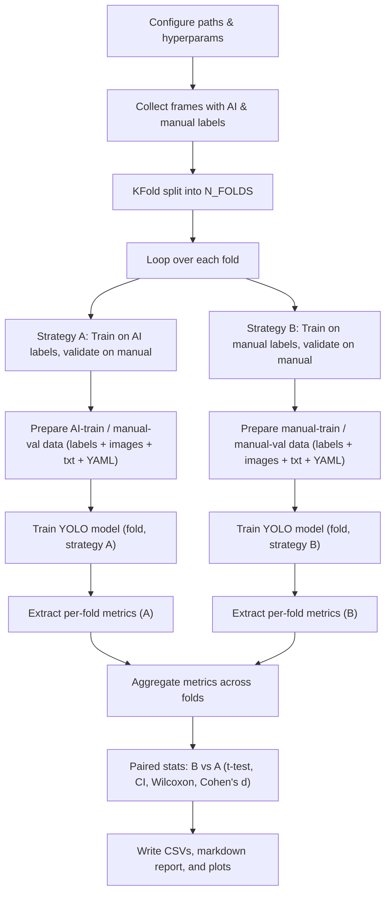

YOLO 5-Fold Cross-Validation Experiment Flow
============================================

This document explains the experiment implemented in `yolo_crossval_compare.py`, which compares object-detection performance when training YOLO on AI-generated labels vs manually annotated labels using the **same 5-fold cross-validation splits**.

- **Strategy A**: Train on AI-generated YOLO labels, validate on manual labels.
- **Strategy B**: Train on manually annotated YOLO labels, validate on manual labels.

In both cases, validation is always done on the same human-annotated labels, and the folds are shared, enabling a strict paired comparison between strategies.

## Experiment flow (Mermaid)

## Paired cross-validation design

- **Shared folds (same images)**: For each fold, Strategy A and Strategy B use the **same train/val image splits**; only the source of the training labels differs (AI vs manual).
- **Intersection over label sets**: Folds are built only from frame IDs that have **both AI and manual YOLO label files**, ensuring that each image can be used in both strategies.
- **Consistent validation labels**: Validation always uses manual labels, so differences between strategies are driven by the **training label source** only.
- **Paired metrics**: For every fold, both Strategy A and Strategy B are run, giving paired metric values (`mAP50`, `mAP50_95`, precision, recall) for robust statistical tests.

## Outputs produced by the script

- **Per-run YOLO outputs** (inside each `fold_X/strategy_*/runs/...` directory): full Ultralytics training artifacts and `results.csv` for that fold and strategy.
- **`all_fold_metrics.csv`**: Aggregated table of per-fold metrics for both strategies (input to the summary, plots, and statistical tests).
- **`statistical_comparison.csv`**: Paired t-tests, confidence intervals, Cohen's d, and Wilcoxon test comparing Strategy B vs Strategy A for each metric.
- **`results_report.md`**: Human-readable summary of cross-validation results, tables, and an interpretation of the statistical comparison.
- **`comparison_plots.png`**: Visualization of per-fold metrics, boxplots comparing strategies, and a radar chart of mean performance across metrics.

